

  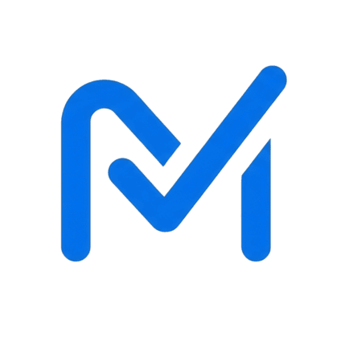

  # Markd: Ultimate Smart Attendance & Timetable Manager
  
  **A specialized attendance tracker and schedule manager designed for students.**
  
  
   

---

## 📖 Overview

**Markd** is a specialized attendance tracker and schedule manager designed for students to effortlessly monitor lecture percentages and maintain academic eligibility. Built with privacy and efficiency in mind, Markd eliminates the need for manual calculations helping you stay above your required attendance criteria no matter how unpredictable your semester gets.

---

## ✨ Key Features

- **🤖 AI Timetable Scanner:** Skip the tedious process of entering your classes manually. Markd features an advanced AI-powered scanner that can instantly read and digitize your timetable. Simply import your schedule via a photo, from your gallery or by selecting a PDF document. The app automatically extracts your subjects, class timings, teachers and assigned classrooms, building your entire schedule in seconds.

- **📊 Comprehensive Attendance Tracking:** Manage your daily classes directly from the dashboard with unparalleled ease. With a single tap, mark your exact status for any given lecture: Present, Absent or Holiday. Participating in a college event or sports meet? Use the **On Duty** status to ensure your official absences are properly recorded without negatively impacting your overall attendance.

- **➕ Extra Class Support:** Semester schedules rarely stay static. Whenever a professor schedules a makeup lecture or an additional test review session, simply add an **Extra Class** to your day. This flexibility ensures your attendance log remains perfectly accurate, reflecting every hour you actually spend in the classroom.

- **🎯 "Safe to Bunk" Predictor & Goal Tracking:** Never worry about unexpectedly falling below mandatory attendance requirements again. Set a custom target attendance percentage for your semester, and Markd will proactively calculate exactly how many upcoming classes you can safely miss without ever dropping below your required threshold.

- **📅 Interactive Calendar:** Navigate your academic life efficiently. The dynamic calendar view clearly highlights days with scheduled classes and provides a detailed breakdown of your daily timetable. Easily view past attendance records, edit historical entries, and manage your full schedule directly from the visual interface.

- **📈 Detailed Analytics Dashboard:** Gain valuable insights into your academic habits. Our visual charts clearly detail your overall attendance percentage, provide subject-wise breakdowns, and track your weekly trends, helping you immediately identify which specific subjects require more attention to stay on track.

- **🔔 Proactive Class Alerts:** Stop relying on memory. Markd sends smart notifications right before each scheduled class begins, prompting you to mark your attendance status the moment you arrive.

- **🔒 100% Private and Local Storage:** Markd is built with strict privacy standards at its core. There are no mandatory accounts, no logins and no cloud syncing required. All of your personal academic data, schedules and analytics are stored securely and entirely locally on your own device.

- **💾 Robust Export, Backup and Restore:** Your data belongs to you. Export your complete attendance history to Excel or PDF format to share with academic advisors, parents, or for your own personal analysis. Switching devices? Easily create a local backup file to seamlessly transfer and restore your entire timetable and attendance history in seconds.

- **🎨 Modern Design:** Enjoy a clean, intuitive, and distraction-free interface that fully supports both light and dark modes, complete with customizable 12-hour and 24-hour time formatting options to match your exact preferences.

---

## 📸 Screenshots

  <table>
    <tr>
      <td>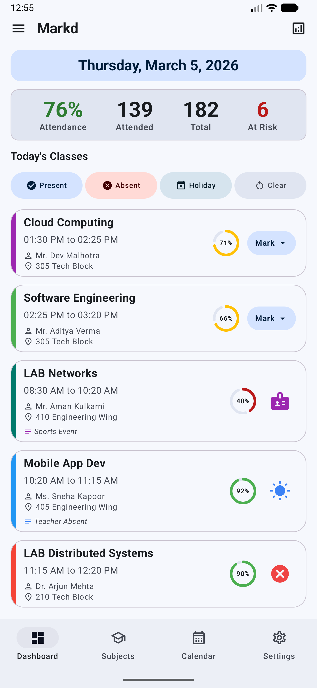</td>
      <td>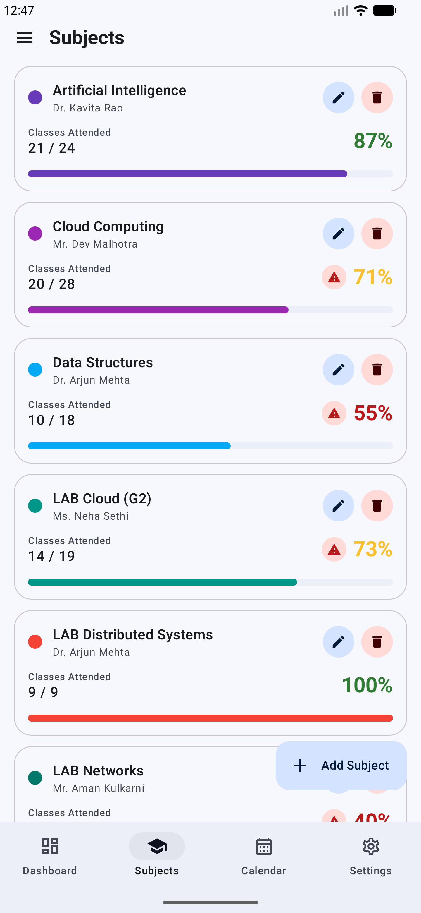</td>
    </tr>
    <tr>
      <td>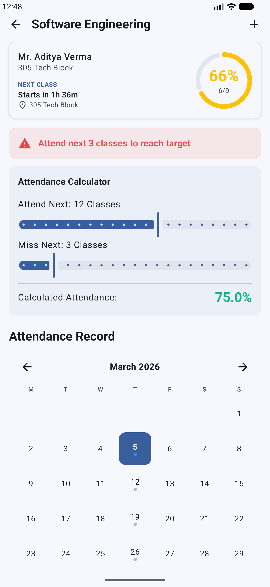</td>
      <td>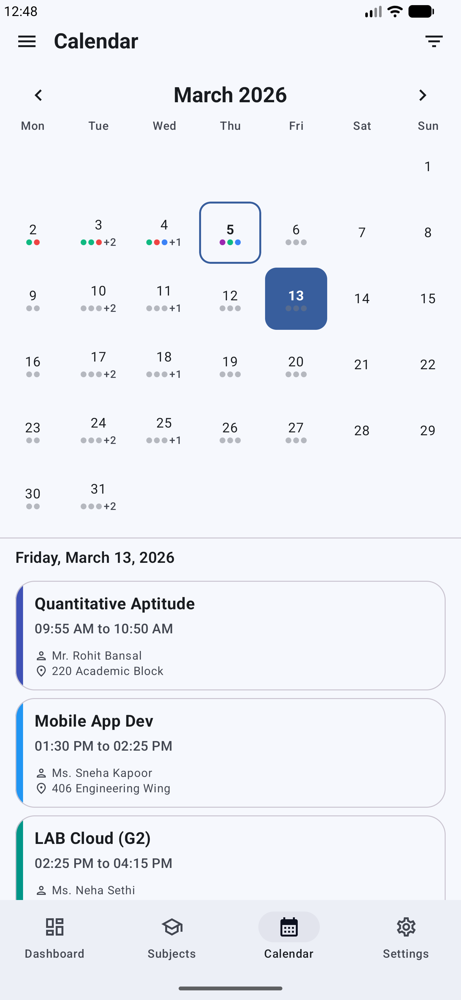</td>
    </tr>
    <tr>
      <td>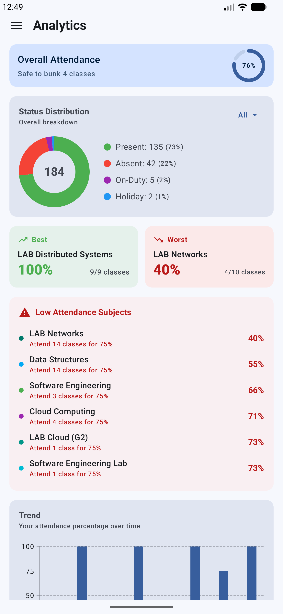</td>
      <td>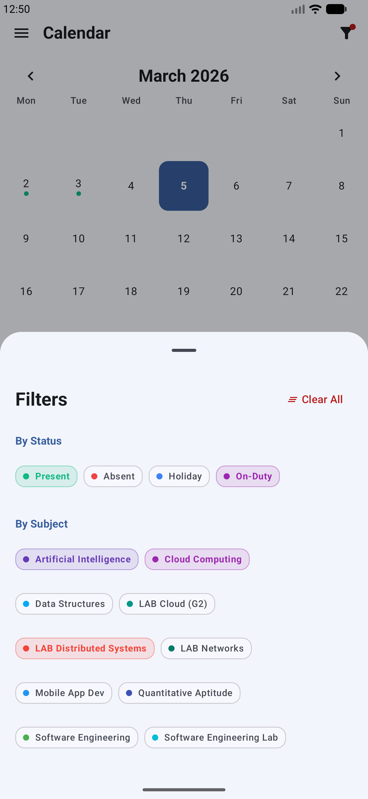</td>
    </tr>
    <tr>
      <td>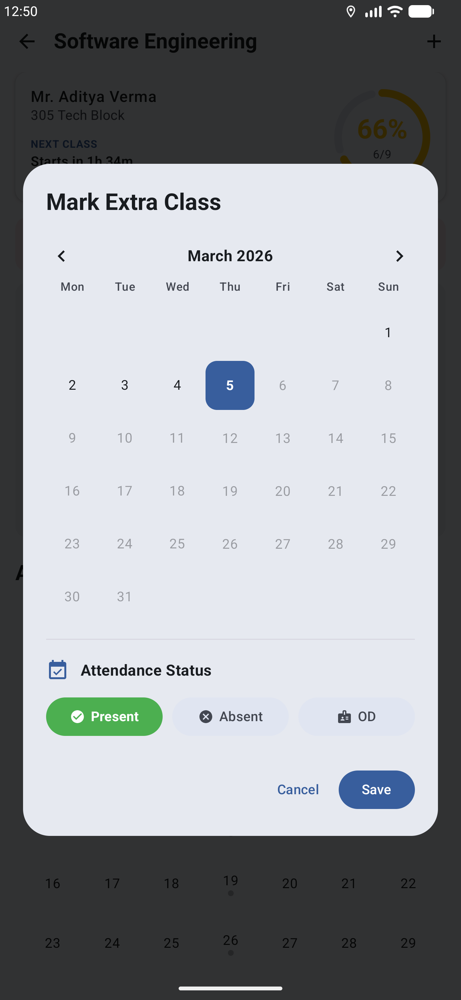</td>
      <td>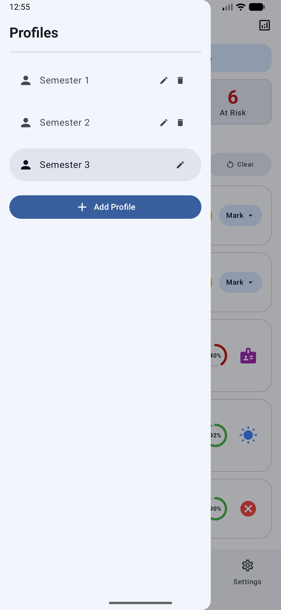</td>
    </tr>
    <tr>
      <td>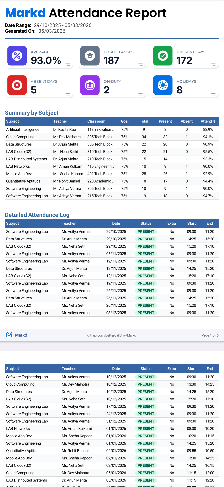</td>
      <td>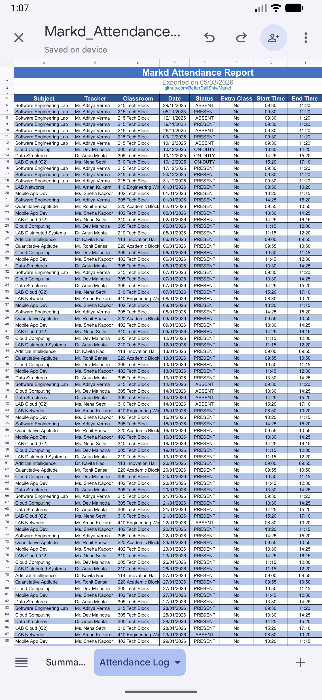</td>
    </tr>
    <tr>
      <td>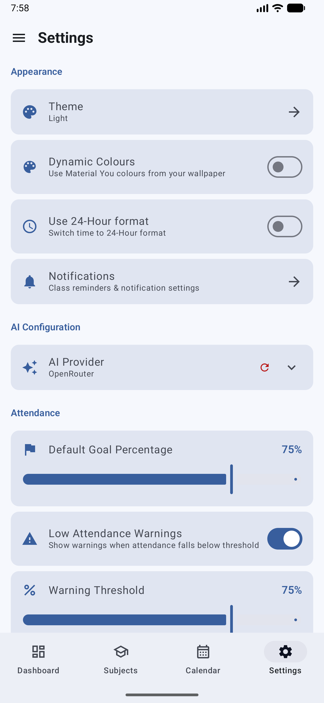</td>
      <td>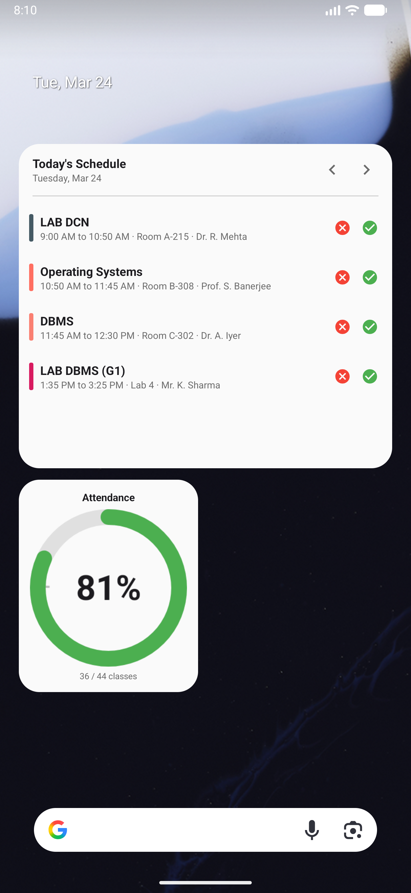</td>
    </tr>
  </table>

---

## 🛠️ Technical Architecture

- **Language:** Kotlin
- **UI Framework:** Jetpack Compose (Material 3)
- **Local Database:** Room Database (SQLite)
- **Preferences Management:** DataStore Preferences
- **Navigation:** Jetpack Navigation Compose
- **Charting Engine:** Vico Compose
- **Data Export:** Apache POI (Excel) & Android Native PdfDocument (PDF)
- **Hardware Integration:** CameraX

---

## 🛡️ Privacy Policy

All user data is stored locally within an encrypted Room database. The app operates offline, ensuring no personal scheduling data is transmitted externally unless explicitly exported by the user. 

Review the complete [Privacy Policy](https://bettercallshiv.github.io/Markd/privacy-policy.html) for more details.

---

## 👨‍💻 Author

**Shivam Raj** ([@BetterCallShiv](https://github.com/BetterCallShiv))
- Email: [bettercallshiv@gmail.com](mailto:bettercallshiv@gmail.com)
- GitHub: [github.com/BetterCallShiv](https://github.com/BetterCallShiv)
